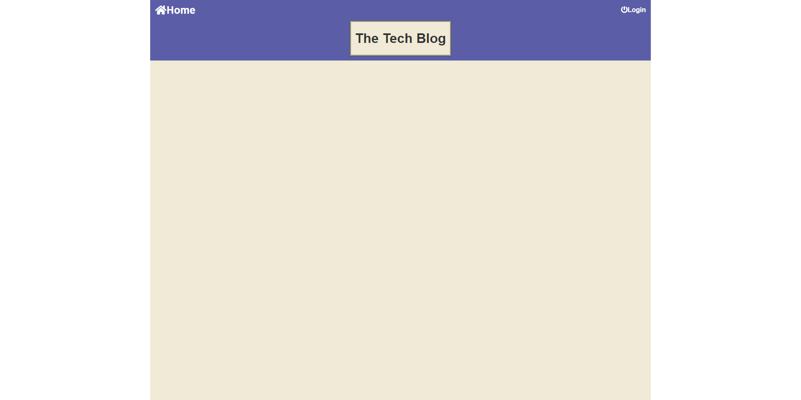
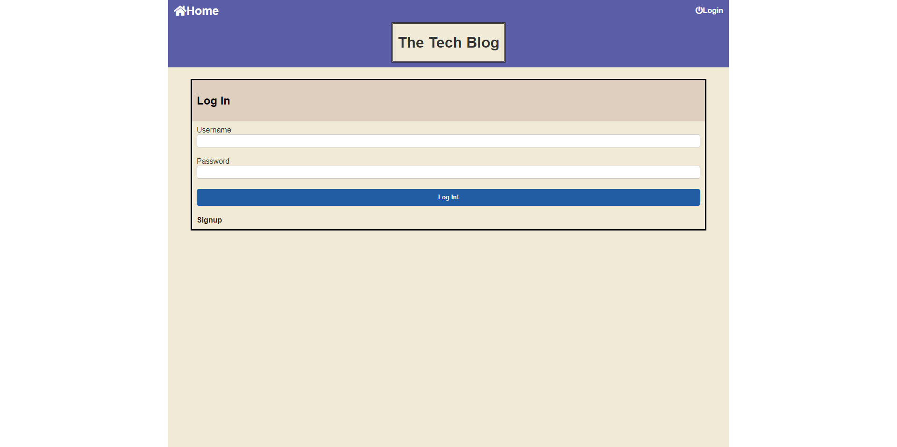

# Model-View-Controller (MVC) Challenge: Tech Blog

Your challenge this week is to build a CMS-style blog site similar to a Wordpress site,
where developers can publish their blog posts and comment on other developers’ posts as well. 
You’ll build this site completely from scratch and deploy it to Heroku. Your app will follow the 
MVC paradigm in its architectural structure, using Handlebars.js as the templating language,
Sequelize as the ORM, and the express-session npm package for authentication.

Your application’s folder structure must follow the Model-View-Controller paradigm. You’ll need to use the express-handlebarsLinks to an external site. package to use Handlebars.js for your Views, use the MySQL2Links to an external site. and SequelizeLinks to an external site. packages to connect to a MySQL database for your Models, and create an Express.js API for your Controllers.

You’ll also need the dotenv packageLinks to an external site. to use environment variables, the bcrypt packageLinks to an external site. to hash passwords, and the express-sessionLinks to an external site. and connect-session-sequelizeLinks to an external site. packages to add authentication.

# Screenshots 

# Deployed [Link] (https://mvc-tech-blog-challenge14.herokuapp.com/)
